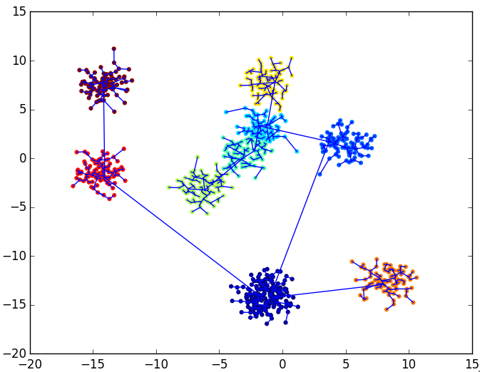

# QuickShiftClustering

[](https://travis-ci.org/rened/QuickShiftClustering.jl)

QuickShift [1] is a fast method for hierarchical clustering, which first constructs the clustering tree, and subsequently allows to quickly cut links in the tree which exceed a specified length. This second step can be performed for different link-lengths without having to re-run the clustering itself. Care has been taken to provide a high-performance implementation.

[1] [Quick Shift and Kernel Methods
for Mode Seeking](http://cronos.rutgers.edu/~meer/TEACH/ADD/vedaldiS08quick.pdf)

#### Functions

```jl
a = quickshift(data[, sigma])
# cluster ndim x nsamplex matrix data.
# sigma: Gaussian kernel width, see paper

labels = quickshiftlabels(a::QuickShift[, maxlinklength])
# cut links in the tree with length > maxlinklength
# return cluster labels for data points.

quickshiftplot(a, data, labels)
# plot data points and hierarchical links
# needs PyPlot installed, only for 2D
```

#### Performance

data 2 x N | Runtime quickshift | Runtime quickshiftlabels
-----------|--------------------|-------------------------
1000       | 0.06 sec           | 0.0002 sec              
10000      | 0.27 sec           | 0.004 sec               
100000     | 9.67 sec           | 0.04 sec                

For larger numbers of data points, you might want to use [KShiftsClustering.jl](https://github.com/rened/KShiftsClustering.jl) to cluster the `N` data points to e.g. 10.000 cluster centers, and then perform QuickShift on those.

#### Example

```jl
using FunctionalData
data = @p map unstack(1:10) (x->10*randn(2,1).+randn(2,100)) | flatten

using QuickShiftClustering
a = quickshift(data)           
labels = quickshiftlabels(a)   

quickshiftplot(a, data, labels)
```


